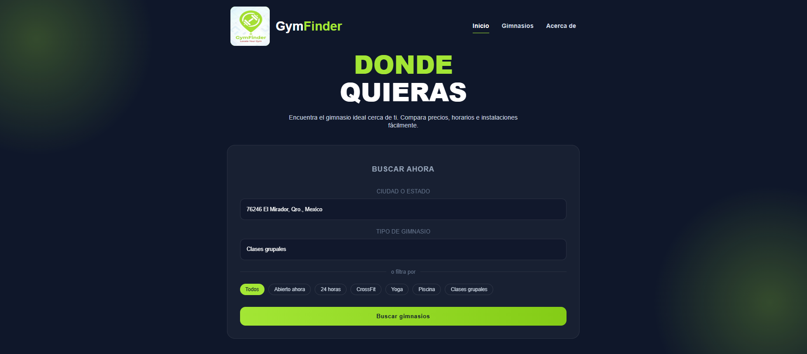
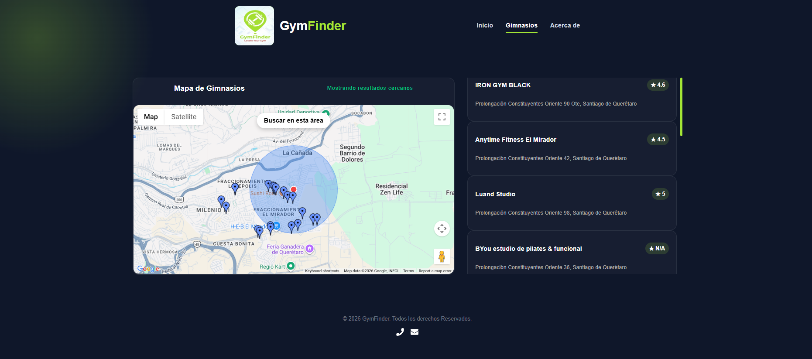
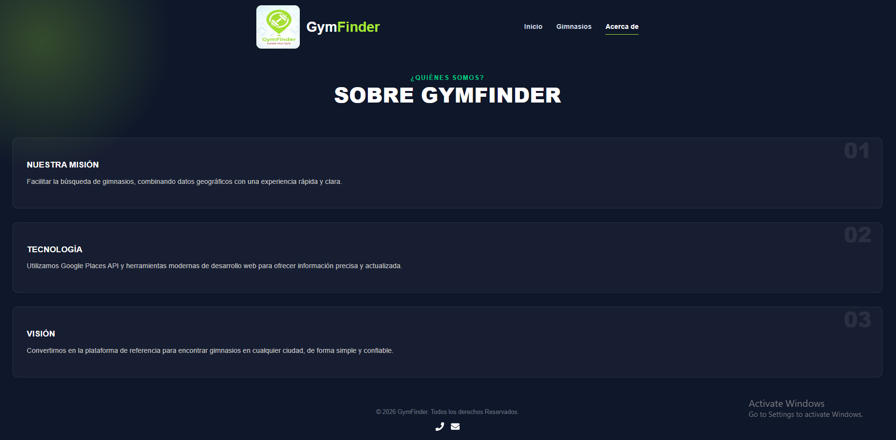

# Gym Finder 

Aplicación web que permite descubrir gimnasios cercanos en un mapa interactivo utilizando la Google Maps JavaScript API y Places API.
Los usuarios pueden buscar gimnasios por ubicación, explorar el mapa, seleccionar gimnasios cercanos y ver información relevante como dirección y calificación.

El proyecto está construido con React + Vite y utiliza la API de Google para obtener resultados reales de gimnasios cercanos.

## Preview

## Características

### Geolocalización automática

Detecta la ubicación del usuario y muestra gimnasios cercanos automáticamente.

### Mapa interactivo

Mapa completamente interactivo usando Google Maps API.

### Marcadores dinámicos

Cada gimnasio aparece como un marcador en el mapa.

### Selección de gimnasio

Al hacer clic en un marcador se muestra:
- Nombre
- Dirección
- Rating

### Buscar en esta área

Si el usuario mueve el mapa puede buscar nuevos gimnasios dentro de esa zona.

### Marcador destacado

El gimnasio seleccionado cambia de icono y animación.

### Datos en tiempo real

Los gimnasios se obtienen usando Google Places API Nearby Search.

### Carga optimizada

Uso de estados de carga y manejo de errores.

## Tecnologías usadas

- React
- Vite
- Google Maps Javascript API
- Google Places APi
- @react-google-maps/api
- Context API
- CSS

## Configuración de API Key

Este proyecto utiliza Google Maps API.

- Crea un archivo .env
- Agrega tu API Key

Habilita estas APIs en Google Cloud:

- Maps JavaScript API
- Places API
- Geocoding API

## Servicio de búsqueda de gimnasios

El proyecto utiliza Google Places Nearby Search para encontrar gimnasios cercanos.

## Flujo de la aplicación

- La aplicación detecta la ubicación del usuario.
- Se renderiza el mapa centrado en esa ubicación.
- Se ejecuta una búsqueda de gimnasios cercanos.
- Los gimnasios aparecen como marcadores en el mapa.

El usuario puede:
- seleccionar gimnasios
- mover el mapa
- buscar en nuevas áreas

## Funcionalidades implementadas

 Integración con Google Maps
 Geolocalización del usuario
 Búsqueda de gimnasios cercanos
 Marcadores dinámicos
 Ventana de información
 Selección de gimnasio
 Botón Buscar en esta área
 Loader de carga
 Manejo de errores

## Mejoras futuras

Mostrar reviews

- Calcular rutas hasta el gimnasio
- Guardar gimnasios favoritos
- Cluster de marcadores

## Pagina

[GitHub Pages link](https://gonzalott.github.io/Front-End-App/)